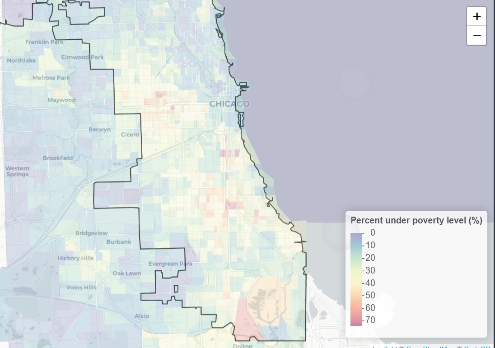
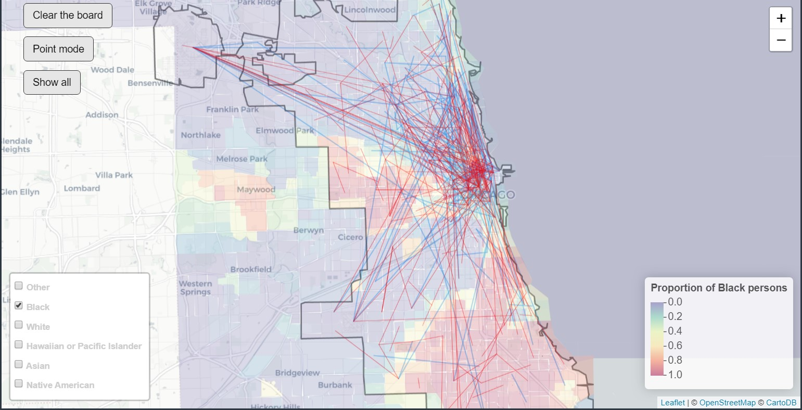

```{r setup, include=FALSE}
library(feather)
library(tidyverse)
library(knitr)
knitr::opts_chunk$set(fig.align='center',
                      fig.pos="H",
                      out.width = "60%") 
```


# 1. Motivation and Topic
 
> This project was partly inspired by a 2018 article in the Atlantic, detailing the extreme “Tale of Two Cities” that characterizes the Chicago of today (Semuels 2018). While portions of the city are booming -- corporations like McDonald's and GE Healthcare have recently moved their headquarters to the loop, Chicago’s downtown area -- and overall unemployment is at a near all-time low -- 4.1% -- neighborhoods across the southern and western portions of the city are struggling.  Crime and gun violence is a plague across portions of the city, and access to jobs, mass transit, and good schools is a function of where one lives. This sharp divide exists along racial lines, as seen by income and poverty statistics by race, compiled from the U.S. Census Bureau’s 2017 American Community Survey 5-year estimates (Bureau n.d.).

> Can Chicago’s segregation be visualized through other means?  Does it extend to, say, commuting and transportation patterns? We stumbled across the City of Chicago’s Open Data Portal, which offers a wealth of information pertaining to city demographics, public safety statistics, 311 service requests, locations of towed vehicles, and -- what would become relevant for our project -- Transportation Network Provider (TNP) pickup and drop-off data (Levy 2019).
	  
> All TNP (ridesharing services, Uber, Lyft, etc.) are required to share data with Chicago.  We imagine that this data is useful for government officials to understand, say, where public transit is inadequate or perhaps where additional infrastructure (Uber/Lyft drop-off/pickup zones) is needed.

> Our question in practice became the following: If we plot ridesharing trips, using the pickup and drop-off census tract locations, and combine it with data on income and poverty metrics by race, will we find patterns?

\newpage

# 2. Data Provenance

> We employ three data sources: the American Community Survey (ACS) 5-Year Estimates Data, City of Chicago Transportation Network Provider data, and some ancillary shapefiles (“American Community Survey 5-Year Data (2009-2017)” 2018; Levy 2019; “Boundaries - City | City of Chicago | Data Portal” n.d.). All of this data was processed and put into the `ChicagoCommute/dataIngest` folder.
	   
> At the highest level, we used the `censusapi` and `tigris` packages to query the ACS and shapefile data, though we did have to spend extensive amounts of time trying to find the correct variable names in the census data. We queried data for each census tract in Cook County, Illinois, which includes the city of Chicago. See details in the [`ChicagoCommute/dataIngest`](https://github.com/Amherst-Horton/STAT231F19-GroupA/tree/master/ChicagoCommute/dataIngest/) folder in the repo. Census ingestion is located in `ChicagoCommute/dataIngest/censusIngest.Rmd`, though some example code is shown here:
	  
```{r, eval=FALSE}
# querying census data
library(censusapi)
#codes for counts of racial group - found with regex
codes_onerace <- c("C02003_008E", "C02003_004E", 
                   "C02003_003E", "C02003_007E", 
                   "C02003_006E", "C02003_005E")

racedf <- censusapi::getCensus(name = "acs/acs5",
                    vintage=2017,
                    vars=c(codes_onerace), 
                    region = "tract:*",
                    regionin = "state:17+county:031")

# shapefiles for Cook County, IL
shapefile <- tigris::tracts(state = "17", county = "031")
```
	  
> Note that we also had to ingest data for Chicago's city borders (which we couldn't find from `tigris`), so the ingestion for that is in `ChicagoCommute/dataIngest/chicagoBorderShapefile.Rmd`.
	  
> The TNP data was queried with the Socrata API, which uses a syntax similar to SQL (“Queries Using SODA | Socrata” n.d.). We queried the data from Valentine's Day 2019 (Feb. 14). Valentine’s Day was an excellent candidate for analysis for a few reasons: we needed to pull a relatively small dataset, and Valentine’s Day -- as both a normal workday (this past year, Valentine’s Day fell on a Thursday) and a holiday -- would provide us with insights on regular commuting patterns and special trips taken to, for instance, dinner nights out with significant others. An example of the code used to query trips on February 14th is below, though we recommend referencing the `dataIngest/chicagoIngest.Rmd` file for details:
 An example is below, though we recommend referencing the `dataIngest/chicagoIngest.Rmd` file for details:
	  
```{r, eval=FALSE}
library(RSocrata)
url <- "https://data.cityofchicago.org/resource/m6dm-c72p.json"
# see chicagoIngest file for instructions on key acquisition
mytoken <- "XXXXXXXXXXXXXXXX"

# query valentine's day data: takes a long time!
valday <- read.socrata(paste0(url, "?",
"$where=trip_start_timestamp between '2019-02-14T00:00:00' and '2019-02-14T23:59:59'"),
app_token=mytoken)
```
	  
\newpage

# 3. Findings 

> We built a Shiny app (accessible [here](https://enochshin.shinyapps.io/ChicagoRideshare/)) to visualize both the TNP and the census data. We encourage readers to follow along and explore for themselves to see if these findings can be justified. See the source code in the `ChicagoCommute/app` directory.

> First, we have some takeaways when we consider the ACS data and ridership data separately: 

> The census data shows us that in Chicago, racial distributions are distinctly segregated, as you can see in Figure 1 and 2 when comparing the distributions of black and white communities:
  
```{r, echo = FALSE, fig.cap="\\label{fig:fig1} Distribution of black persons in Cook County according to ACS 2017"}

```
  
```{r, echo = FALSE, fig.cap="\\label{fig:fig2} Distribution of white persons in Cook County according to ACS 2017"}

```


> As you can see, the percentage of white people is inverse from the percentage of black people, which proves what we already knew going in: that Chicago is a highly segregated city.
  
> We also see that race and income highly correlated, as seen in Figure 3: when we compare the distribution of black communities in Figure 1 with the distribution of percent of families under the poverty level, we see a correlation--south Chicago has a higher poverty rate, coinciding with the higher proportion of black people:

```{r, echo = FALSE, fig.cap="\\label{fig:fig3} Percentage under poverty level in Cook County according to ACS 2017"}

```


> Let us discuss some initial takeaways from the TNP data: on Valentine’s Day 2019, there were 315,613 total rides taken with TNP providers. The median trip distance was 3.6 miles and heavily left-skewed. The median trip duration was 15 minutes, similarly left-skewed. 66% of rides were taken during the day, while 34% of rides were taken after sunset. The accompanying code that proves these insights is below: 

```{r, warning=FALSE}
valday <- feather::read_feather("ChicagoCommute/feather/valday.feather")
#total number of rides
nrow(valday)
# summary for trip miles traveled per ride
mosaic::favstats(valday$trip_miles)
# average duration of ride
mosaic::favstats(valday$trip_seconds)/60
ggplot(valday, aes(x=as.numeric(trip_miles))) + 
  geom_histogram(bins=35) +
  ggtitle("Number of miles traveled per trip") +
  xlab("Miles")

# count trips based on before or after sunset
# sunset on Valentine's Day 2019 was at 5:22 CST
## which is 11:22 PM UTC
sunset <- lubridate::as_datetime("2019-02-14 23:22:00")
sunset

# number of rides before and after sunset
day <- filter(valday, valday$trip_start_timestamp < sunset)
evening <- filter(valday, valday$trip_start_timestamp >= sunset)

pct_day <- nrow(day)/nrow(valday); pct_day
pct_evening <- nrow(evening)/nrow(valday); pct_evening
```


> Now let us discuss the takeaways from mapping our sample of n=500 of the TNP data: We see in Figure 4 and 5 that there could be some slight differences in where rideshare users go during the day versus the evening--namely, it seems that daytime users are more concentrated around the Loop, while nighttime riders are less so. 	
> Now let us discuss the takeaways from mapping our sample of n=500 of the TNP data: We see in Figure 4 and 5 that there could be some slight differences in where rideshare users go during the day versus the evening--namely, it seems that daytime users are more concentrated around the Loop, while nighttime riders are less so. This could suggest that ridesharing services during the day are primarily used to travel to/from offices or attractions in the Loop, while evening users of rideshare services have a wider variety of pickup locations and destinations (Chicago is famously known as a “city of neighborhoods”, and restaurants/evening destinations are distributed throughout the city -- far more so than employment, which is largely concentrated in the Loop) (Zotti 2019). 

```{r, echo = FALSE, fig.cap="\\label{fig:fig4} Distribution of daytime TNP trips on Valentine's Day"}

```

```{r, echo = FALSE, fig.cap="\\label{fig:fig5} Distribution of nighttime TNP trips on Valentine's Day"}

```

> Overall, we see that the most popular locations are O'Hare Airport and the Loop. But what happens when we combine the demographic census data and the ridership data?

\newpage

## Bringing it all together: Chicago TNP Ridership and Demographics

> Can we say that there are racial and/or socio-economic differences in ridesharing service use? Not necessarily, but maybe. 

> We see in the following figures that income metrics like percent under poverty level have a strong correlation with the rideshare service patterns. Similarly, there appears to be a relationship between the distribution of black and white neighborhoods versus the rideshare activity. 

> Again, we encourage you to judge for yourselves in the application.

```{r, echo = FALSE, fig.cap="\\label{fig:fig6} Distribution of TNP trips on Valentine's Day, with Percent under poverty level"}

```

> Evidently, rides are heavily concentrated around higher-income areas, with some scattered trips in lower-income regions. But what about race?

```{r, echo = FALSE, fig.cap="\\label{fig:fig7} Distribution of TNP trips on Valentine's Day, with percent of black persons"}

```

```{r, echo = FALSE, fig.cap="\\label{fig:fig8} Distribution of TNP trips on Valentine's Day, with percent of white persons"}

```


> There are less rides concentrated in majority-black areas, with some exceptions when you zoom into the Loop. The relationship holds for the distribution of white people: more representation in the Loop, and more concentration of TNP trips.  

> We caution that these relationships do not necessarily indicate discrimination on the part of the private TNP services. And it could be that those further from the Loop have other preferred transport methods. The fact that much of the ridesharing activity happens around airports and the Loop could indicate that rideshare services are primarily used by visitors, which is a factor that should also be considered. In other words, people who use services like Uber may not be representative of native Chicagoans as a whole.

> Nevertheless, we see from these figures that Chicago is a locus of inequality: the question of whether the TNP data is indicative of this inequality is a difficult one to answer. We might reasonably conclude that in terms of supply and demand, poorer nonwhite communities do not use rideshare services. Future explorations could focus on whether this is a problem of unequal access to transportation.

# 4. Conclusions and Limitations

> Our work examines one mode of transportation -- ridesharing.  According to a 2018 Gallup poll, ridesharing users are generally younger and wealthier than the American population as a whole (Gallup 2018).  Assuming Chicago follows these national trends, our look at ridesharing trips provides us with insight on a sample of Chicago’s commuters that is not representative of the city as a whole.  Further, the Gallup poll suggests that our findings relating to the distribution of ridesharing trips across Chicago -- in particular, that ridesharing appears less prevalent among poor and minority populations -- are true of cities across the country, though Chicago’s sharp racial and socio-economic divides across neighborhoods provides for a perhaps unique visualization.  One area of further study could be an extension of this same analysis to other cities in the U.S. to see whether the same patterns do in fact materialize. 

> Additionally, our app examines only a sample of 500 trips from Valentine’s Day, 2019.  To ensure that our findings do in fact generalize to general ridesharing patterns across the city of Chicago, further study is necessary of larger trip samples from weekdays, weekends, and holidays across the calendar year.  Valentine’s Day 2019 also happened to be one of the warmest on record (global warming!) (Skilling 2019), suggesting that it may be difficult to generalize our findings to other past or future Valentine’s Days -- warmer weather may induce travel if individuals would have otherwise stayed home, or it may induce individuals who would have otherwise used a ridesharing service to walk, cycle, or wait outside for a bus or train.  

> Nevertheless, the scope of our analysis does allow for some applications.  First, our visual dashboard is a useful tool for visualizing ridesharing trips in Chicago, and it could be used to visualize other samples of Chicago TNP data or other transportation datasets that include pickup and dropoff points (Chicago taxi data, for instance).  Chicago city planners could find it useful for regulatory decisions -- perhaps Chicago could implement something akin to New York City’s “Boro Taxi” service, which is designed to better serve neighborhoods that are underserved by traditional taxi or ridesharing services  (Giuffo 2013).  City officials could also use it as a tool to determine where public transportation is inadequate or where high travel demand could warrant new transportation investments. From our visualization, high rider numbers are evident between the Loop and O’Hare airport, suggesting that perhaps an express train between the two destinations could be a useful investment -- a project by Elon Musk’s Boring Company and supported by the previous mayor to do just that was recently cancelled (Hilburg 2019).  Meanwhile, rideshare drivers could use the tool to determine where and when demand is highest and plan their work schedules accordingly.  Finally, rideshare users can use the tool to determine the distribution of rideshare drivers -- requesting an Uber in a neighborhood far from the Loop and/or one statistically poorer or majority minority may result in a long wait time.

\newpage

# Appendix


## Works Cited


"American Community Survey 5-Year Data (2009-2017)." 2018. *The United States Census Bureau.* December 6, 2018. https://www.census.gov/data/developers/data-sets/acs-5year.html.

"Boundaries - City | City of Chicago | Data Portal." n.d. Accessed December 7, 2019. https://data.cityofchicago.org/Facilities-Geographic-Boundaries/Boundaries-City/ewy2-6yfk.

Bureau, US Census. n.d. "American Community Survey (ACS)." *The United States Census Bureau.* Accessed December 7, 2019. https://www.census.gov/programs-surveys/acs.

Gallup. 2018. “Snapshot: Who Uses Ride-Sharing Services in the U.S.?” *Gallup, Inc.* July 25, 2018. https://news.gallup.com/poll/237965/snapshot-uses-ride-sharing-services.aspx.

Giuffo, John. 2013. “NYC’s New Green Taxis: What You Should Know.” September 30, 2013. Accessed December 9, 2019. https://www.forbes.com/sites/johngiuffo/2013/09/30/nycs-new-green-taxis-what-you-should-know/#5dc4571e32a2.

Hilburg, Jonathan. 2019. “O’Hare Express System, Elon Musk’s Chicago Transit Plan, May Be Dead.” 2019. *Archpaper.com* (blog). June 14, 2019. https://archpaper.com/2019/06/ohare-express-system-elon-musk-system-dead/.

Levy, Jonathan. 2019. "Transportation Network Providers - Trips | City of Chicago | Data Portal." October 21, 2019. https://data.cityofchicago.org/Transportation/Transportation-Network-Providers-Trips/m6dm-c72p.

"Queries Using SODA | Socrata." n.d. Accessed December 7, 2019. https://dev.socrata.com/docs/queries/.

Richards, Mary Wisniewski, Jennifer Smith. n.d. "Uber and Lyft Said Ride-Sharing Would Cut Traffic Congestion and Supplement Public Transit. But Has It Worked?" *Chicagotribune.com* Accessed December 7, 2019. https://www.chicagotribune.com/news/breaking/ct-biz-ride-share-congestion-loop-20190520-story.html.

Semuels, Alana. 2018. "Chicago's Awful Divide." *The Atlantic* March 28, 2018. https://www.theatlantic.com/business/archive/2018/03/chicago-segregation-poverty/556649/.

Skilling, Tom. 2019. “Mildest Chicago Valentine Day in Two Years—and the 13th-Warmest on the Books—but Arctic Air’s Returned | WGN-TV.” February 14, 2019. Accessed December 9, 2019. https://wgntv.com/2019/02/15/mildest-chicago-valentine-day-in-two-years-and-the-13th-warmest-on-the-books-but-arctic-airs-returned-atmospheric-
rivers-drenching-rains-highs-wind/.

Zotti, Ed. 2019. “Where the Jobs Are in Chicago: Downtown, and That’s a Good Thing.” *Chicago Sun-Times.* August 9, 2019. https://chicago.suntimes.com/columnists/2019/8/9/20759346/chicago-jobs-employment-downtown-loop-
income-equality-ed-zotti-city-crossroads. 
